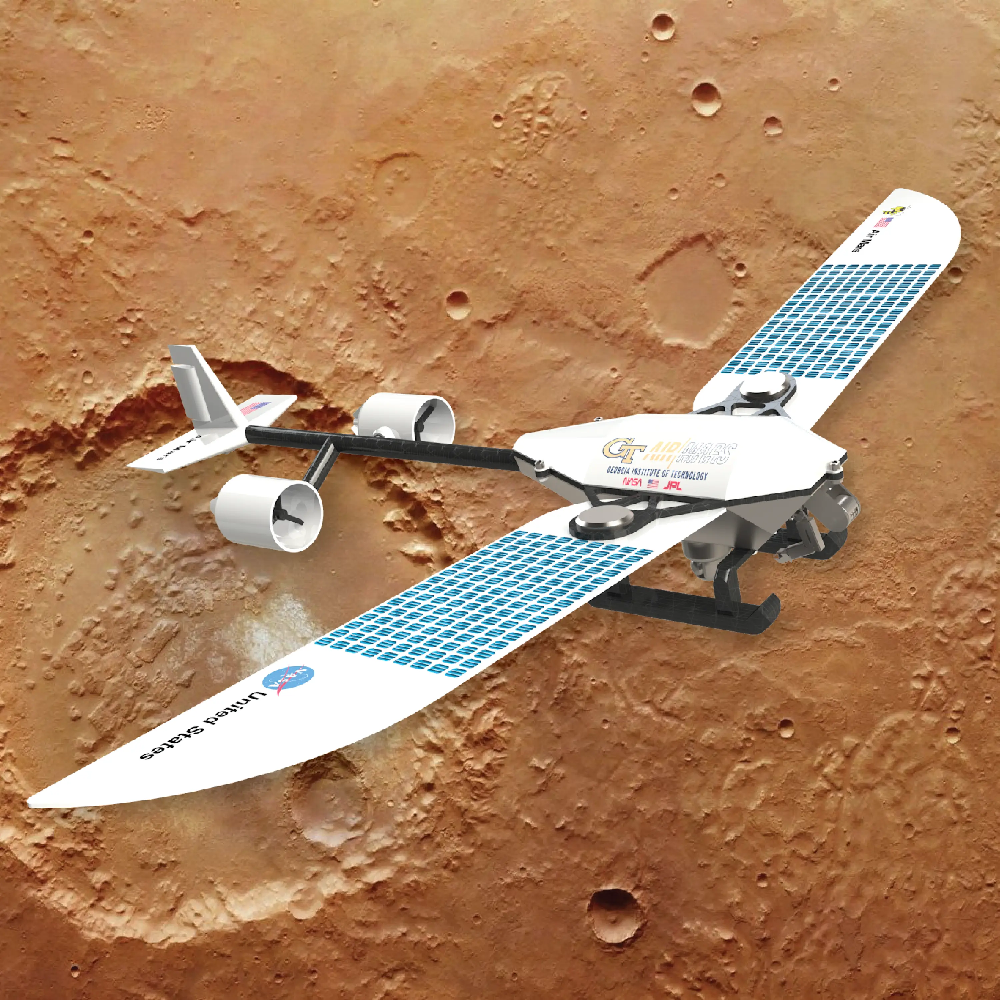
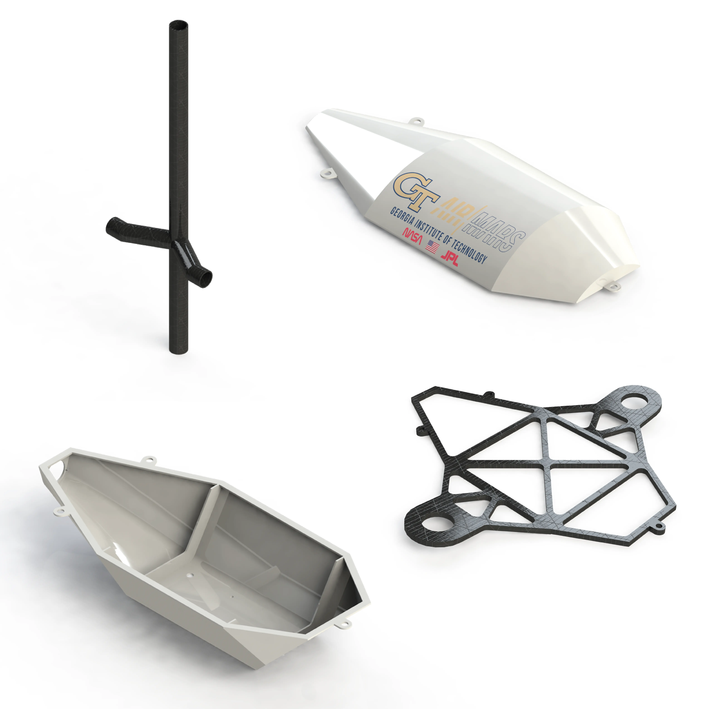
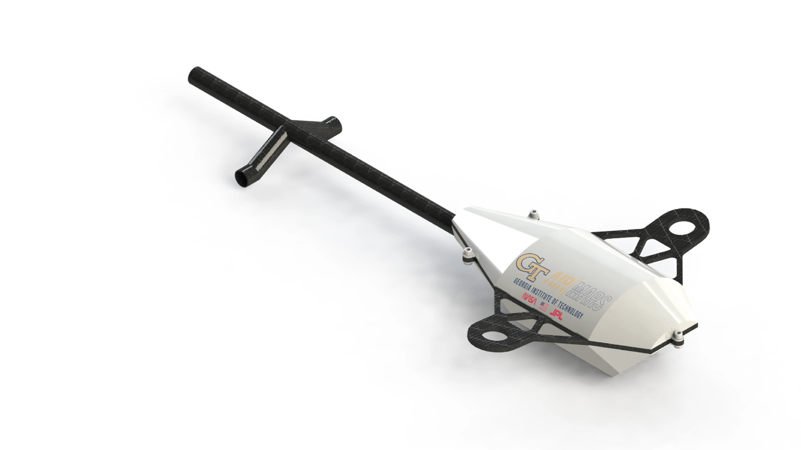

_Final drone assembly render._

In my second semester at Georgia Tech I took a class called Engineering Graphics, which was basically a course on learning SolidWorks. The class included a group project where I worked with some friends to conceptualize an aerial drone to explore Mars. The parts that I designed for the drone can be seen in Figure 2. I also was in charge of keeping everyone's parts organized in a single assembly and creating various renders for our final presentation.

_Parts I designed._

While I had fun making various parts and learning more about SolidWorks, I think learning to communicate effectively was by far the most important skill I developed from this experience. Initially we ran into a lot of problems, especially having to do with scale. Since everyone's parts interfaced with at least one other person's set of parts, we had to be deliberate in establishing consistent dimensions across parts. To simplify things, we had everyone work on a specific subassembly of the drone, so that there would be fewer interfaces between different people's parts.

_Subassembly I designed._
