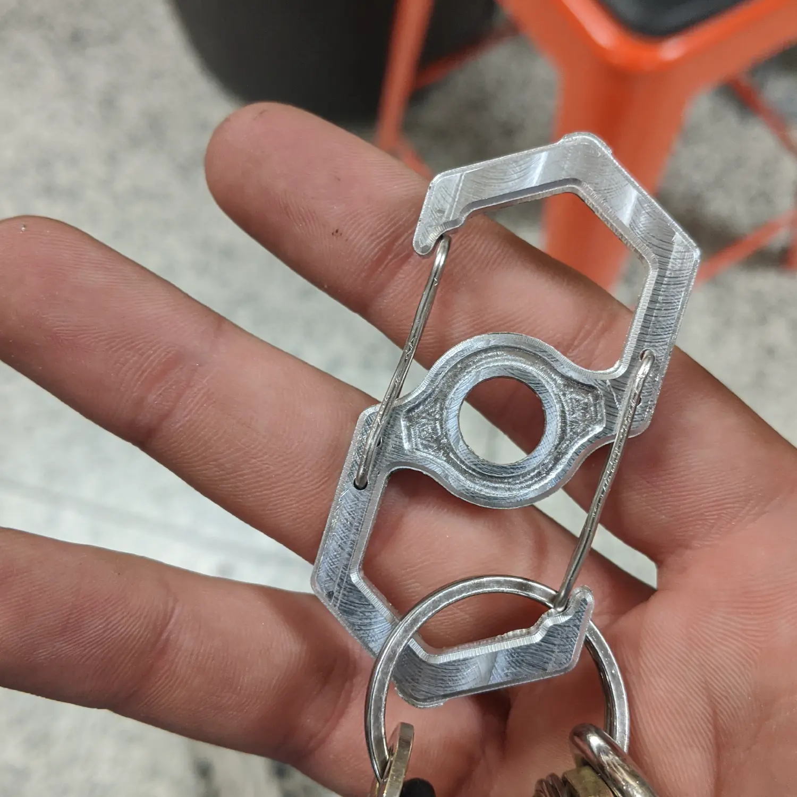
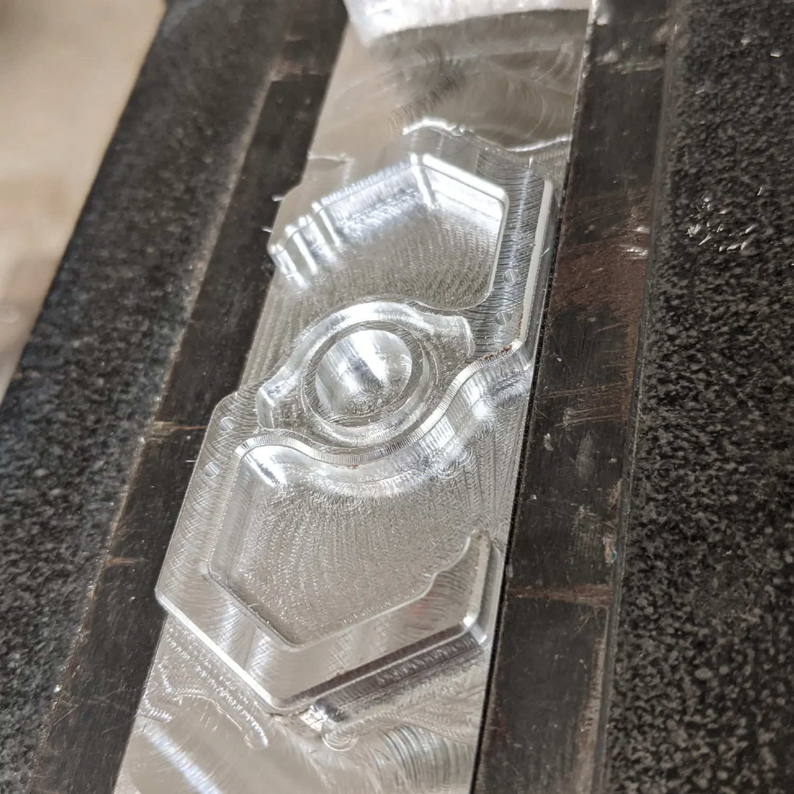

_Finished carabiner._

This was one of the first projects I made while figuring out the CNC machining
process. With the help of some friends, I first learned how to operate the mill
I would be using &mdash; a Series 1 Tormach PCNC 1100. After familiarizing
myself with the basics &mdash; workholding, toolchanging, jogging axes, sending
basic GCODE commands, etc. &mdash; I moved on to the CAD/CAM process.

I designed the carabiner in Fusion 360 so that it could be machined mostly on
one side, with just a chamfer operation on the opposite side. Here's a rundown
of the CAM operations I used:

- Face stock with 1/2" endmill
- 2D adaptive clear with progressively smaller endmills, starting at 1/2"
- Finishing contour with 1/8" endmill
- 2D pocket with 1/16" ball endmill
- Drill holes with 1/16" drill bit
- Chamfer with 1/4" chamfer bit

_Carabiner after initial machining operations._

Overall I think the carabiner came out pretty nice. It definitely isn't perfect,
but I had fun making it and definitely learned a lot about CNC machining.
