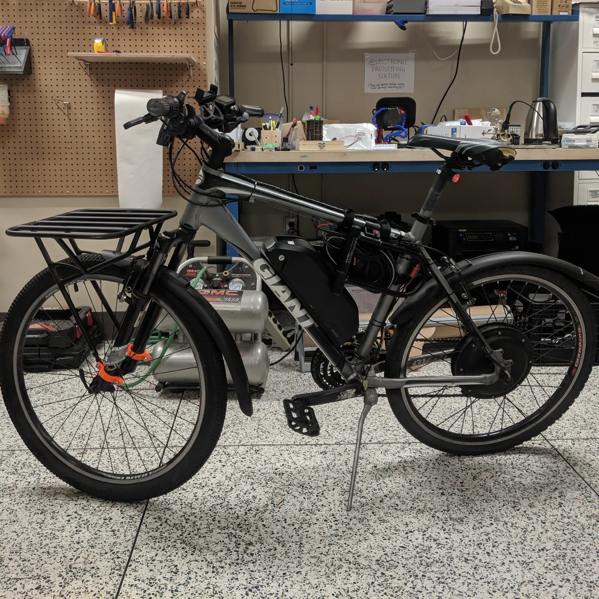
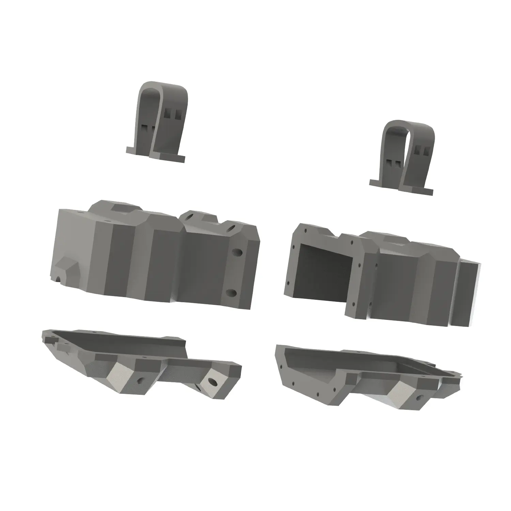

_Completed case installed on bike._

Recently I purchased a kit to turn my regular bike into an electric bike. It came with a hub-style motor, 1000W controller, a throttle, and a battery. To secure the controller onto the bike frame, the kit came with a bag, which worked, but it was kind of... not visually appealing and didn't really allow for neat wire management. Figure 2 shows what my bike looked like with the bag mount. To solve these problems, I decided to 3D print a case that would allow for neater wire management and an overall cleaner design. I ended up designing a 4 part case that used screws and brass heat-set inserts to secure everything together. It also had anchors for zip-ties to keep cables neatly stowed away.

_Bike prior to 3D printed case._

This project ended up being the perfect test of my recently upgraded CoreXY 3D Printer. Up until this point, I had only ever printed relatively small parts. I was happy to see that all of the case parts (each taking around 8-10 hours to print) printed successfully. I think the final product came out pretty well, and I really like the overall look of the bike.

_Exploded case assembly._
