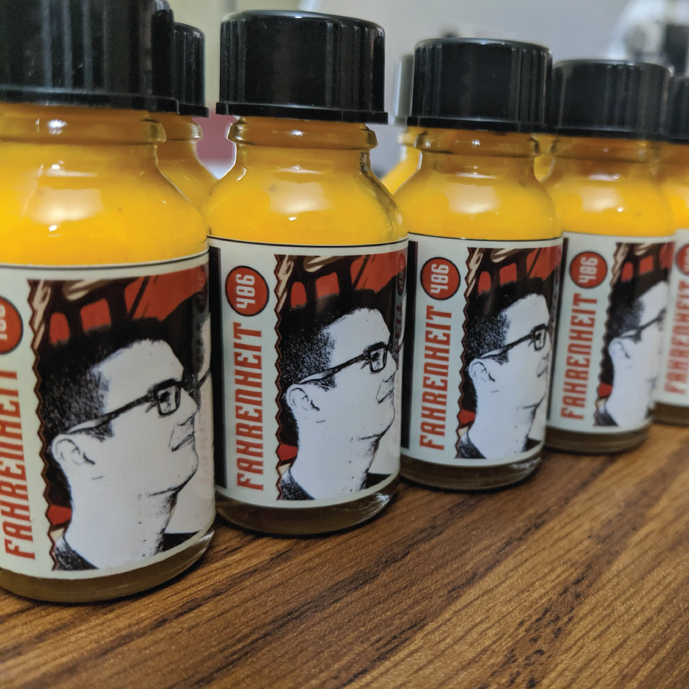
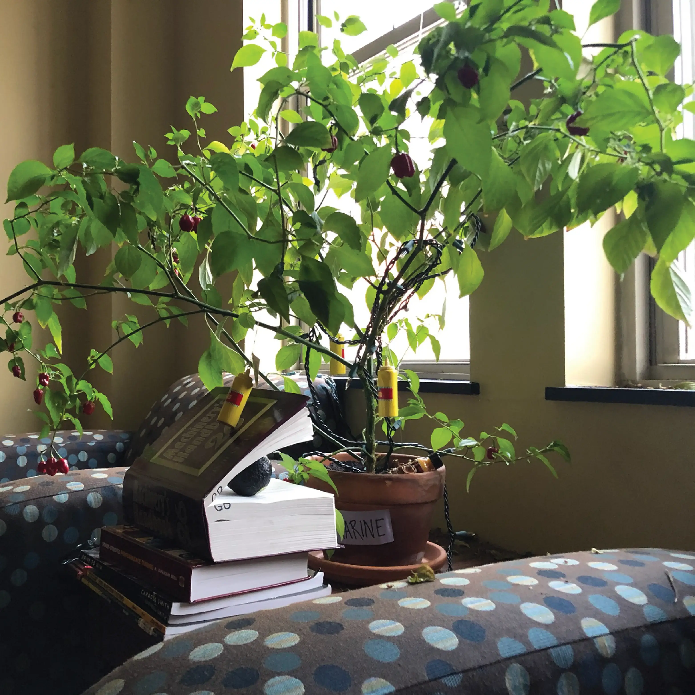

_Bottles of sauce._

During my junior year at Georgia Tech I grew habanero peppers in my apartment. I thought it would be fun to make hot sauce with the peppers I grew and I decided to get my roommates in on it too. We came up with the name "Fahrenheit 406," since our apartment number for the year was 406. We took pictures of ourselves and I designed and printed labels for the bottles. While the production value of the sauce was at a solid level, the sauce itself just didn't taste great and the consistency was a little off.

_Habanero pepper plant._

Sometime after our first batch, we made a trip to the DeKalb Farmer's Market and picked up some ghost peppers. We settled on a ghost pepper & mango recipe and set about making Version 2 of the hot sauce. I think it came out great, and a lot of our friends really enjoyed it. Unfortunately I didn't take too many pictures of the new sauce, but I have some images of the labels. I also had the idea to make laser cut balsa wood crates as packaging. With the help of a friend I machined a small aluminum crowbar for opening the crate. I'm sure if we ever get the chance we'll make some more sauce.
