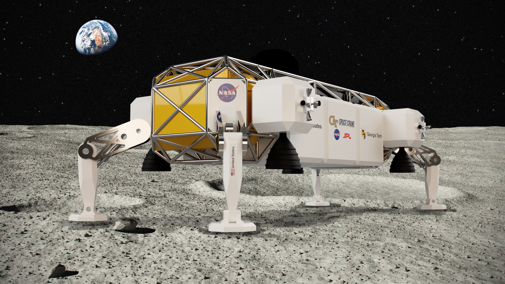

_Space Crane concept render._

During summer 2019 I took a systems engineering class. One of the assignments was a group project involving the development of a reusable lunar access vehicle. As the name of the class suggests, the project focused on the systems engineering aspects of such a vehicle &mdash; defining the problem through requirements and goals, creating CONOPS, developing mission timelines, creating interface diagrams and morphological matrices, etc.

I worked with two of my friends to create a concept architecture that we called the "Space Crane," which was inspired, at least in design, by the Eagle Transporter from the _Space: 1999_ TV show. I created all of the concept architecture CAD in Fusion 360 and I designed the CONOPS diagram using Adobe Illustrator and Photoshop. I helped out with writing some of the mission requirements and the mission morphological matrix. I also developed a project timeline based on timelines for NASA's Altair and James Webb Space Telescope projects.
