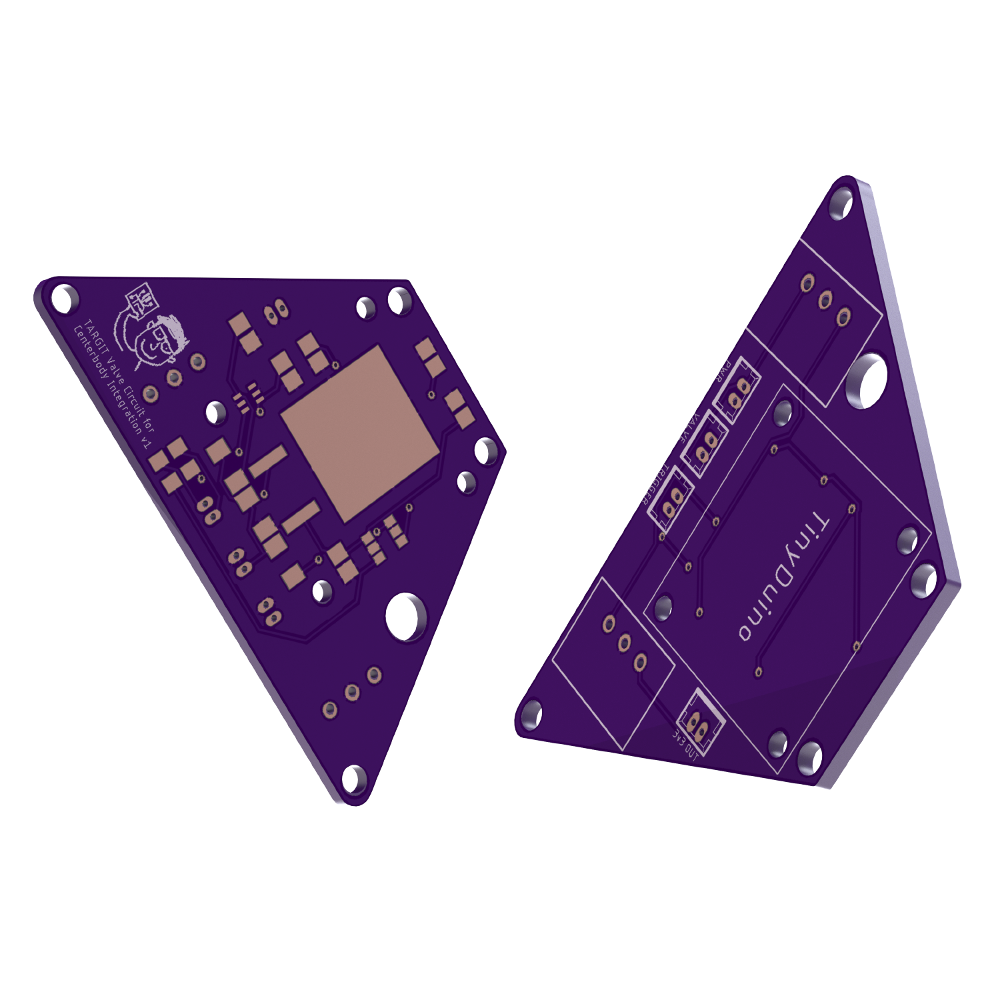
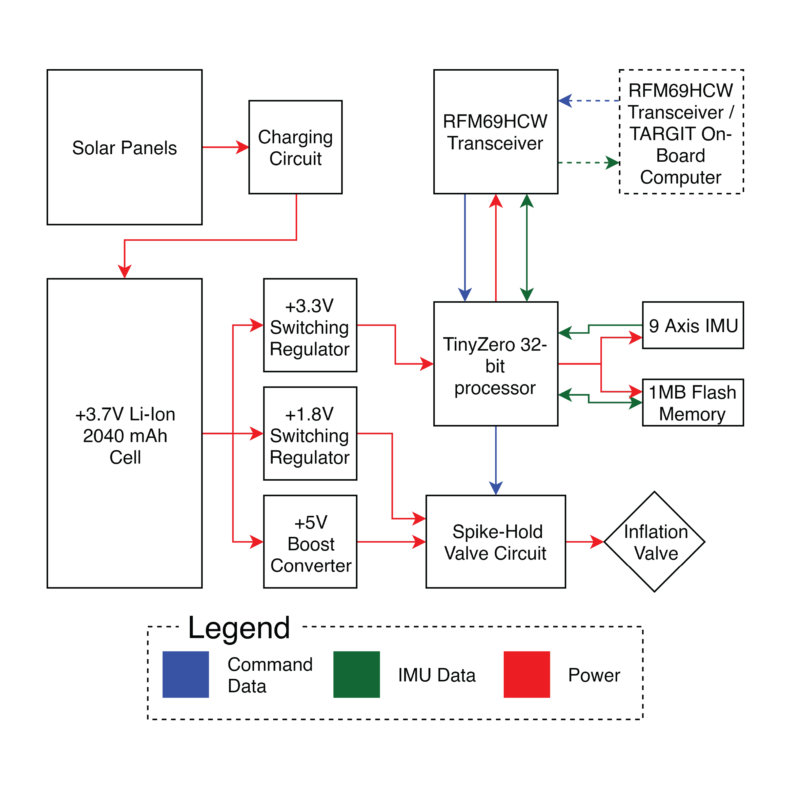

import ImageGrid from '../../components/ImageGrid.astro'
import milledBoard from "../../assets/targitelec-01.png"
import proBoard from "../../assets/targitelec-02.png"
import stack from "../../assets/targitelec-05.png"
import comparison from "../../assets/targitelec-03.png"

_Motherboard PCB render._

For a little background information, The Tethering and Ranging Mission of the Georgia Institute of Technology (TARGIT) is a CubeSat Mission with the primary objective of demonstrating a LiDAR imaging system on a CubeSat platform. In order to test this imaging system, the satellite will deploy a small target with its own power system, electronics, communications equipment, and sensors, that will inflate a mylar balloon. This mylar balloon will serve as the target for the satellite's imaging operations. You can read more about the project [here](https://bgunter.gatech.edu/research/targit).

When I first started on the project in the fall of 2018, I worked on developing some of the electronics systems for the target subsystem. Due to ITAR restrictions, I can't share a lot of specific details or files of my work, but I can explain the system requirements and functionality on a high level. The system is centered around the TinyZero Microcontroller, which is basically just a tiny 32-bit Arduino. I designed a motherboard for the TinyZero (Figure 1) that features power management/distribution features and a circuit that actuates solenoid valves to inflate the mylar balloon. I also designed a small shield for the TinyZero that allows it to interface with a radio transceiver. This radio transceiver is what communicates with the main satellite.

_High level electronics schematic._

Over the course of two semesters, I learned how to use Autodesk EAGLE to design circuits and PCBs. I used on-campus resources, like the Mechanical Engineering Electronics Lab, to get single sided PCBs milled to prototype with. After validating my design, I moved on to a more compact two-sided design that was professionally manufactured via OSHPark. I sourced all the components for the board via DigiKey and assembled the board using a soldering iron. You can see the progression from prototype to completed board in the images below.

<ImageGrid
    images={[[milledBoard, "a single sided PCB milled from a copper clad board."], [proBoard, "a PCB manufactured by OSHPark."], [stack, "a stack of TinyZero shields."], [comparison, "A side by side view of the prototype board with the completed board."]]}
    caption="Progression of board through development cycle."
    rows="grid-rows-2"
    cols="grid-cols-2"
    clickable
/>
